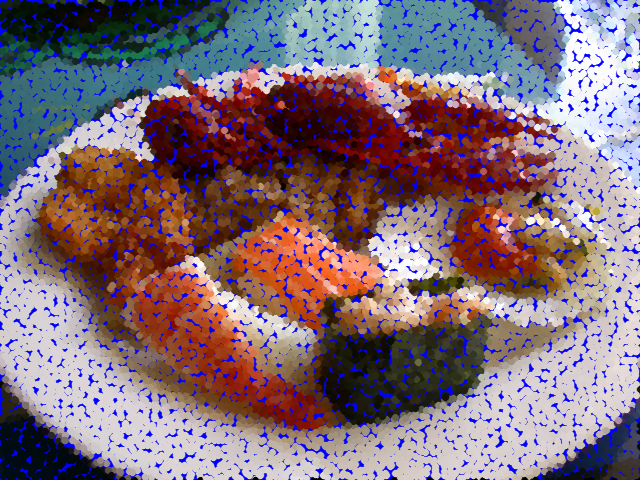

:toc: left
:source-highlighter: highlightjs

= Detecção de bordas com o algoritmo de Canny e a arte com pontilismo

O problema consiste em utilizar as bordas produzidas pelo algoritmo de Canny para melhorar a qualidade da imagem pontilhista gerada

Programa cannypoints.cpp:
[source,C++]
----

#include <iostream>
#include "opencv2/opencv.hpp"
#include <algorithm>
#include <cstdlib>
#include <ctime>
#include <fstream>
#include <iomanip>
#include <iostream>
#include <numeric>
#include <vector>

#define STEP 5
#define JITTER 3
#define RAIO 3

int top_slider = 10;
int top_slider_max = 200;

char TrackbarName[50];

cv::Mat image, border, points,imgray;
int width, height;
int x, y;
cv::Vec3b colors;
std::vector<int> yrange;
std::vector<int> xrange;

void on_trackbar_canny(int, void*){
  cv::Canny(imgray, border, top_slider, 3*top_slider);
  cv::imshow("Canny", border);
  points = cv::Mat(height, width, CV_8UC3, cv::Scalar(255));
  std::random_shuffle(xrange.begin(), xrange.end());
  for (auto i : xrange) {
    std::random_shuffle(yrange.begin(), yrange.end());
    for (auto j : yrange) {
      x = i + std::rand() % (2 * JITTER) - JITTER + 1;
      y = j + std::rand() % (2 * JITTER) - JITTER + 1;
      colors = image.at<cv::Vec3b>(x, y);
      cv::circle(points, cv::Point(y, x), RAIO, CV_RGB(colors[2], colors[1], colors[0]),
                 cv::FILLED, cv::LINE_AA);
    }
  }
  cv::imshow("Canny", points);
}

int main(int argc, char**argv){
  image= cv::imread(argv[1], cv::IMREAD_COLOR);
  cv::cvtColor(image,imgray, cv::COLOR_BGR2GRAY);

  std::srand(std::time(0));

  if (image.empty()) {
    std::cout << "Could not open or find the image" << std::endl;
    return -1;
  }

  width = image.cols;
  height = image.rows;

  xrange.resize(height / STEP);
  yrange.resize(width / STEP);

  std::iota(xrange.begin(), xrange.end(), 0);
  std::iota(yrange.begin(), yrange.end(), 0);

  for (uint i = 0; i < xrange.size(); i++) {
    xrange[i] = xrange[i] * STEP + STEP / 2;
  }

  for (uint i = 0; i < yrange.size(); i++) {
    yrange[i] = yrange[i] * STEP + STEP / 2;
  }
  
  sprintf( TrackbarName, "Threshold inferior", top_slider_max );

  cv::namedWindow("Canny",1);
  cv::createTrackbar( TrackbarName, "Canny",
                &top_slider,
                top_slider_max,
                on_trackbar_canny );

  on_trackbar_canny(top_slider, 0 );

  cv::waitKey();
  cv::imwrite("cannypoints.png", points);
  return 0;
}

----

O procedimento usado para criar a técnica pontilhista foi definir o threshold inferior para que delimitar as bordas do algoritmo de Canny, ou seja pegar as bordas que eu queira utlizar e aplicar o pontilismo na imagem.

:imagesdir:

.Imagem Original.

image::sushi.jpg[sushi]

Imagem criada a partir do programa:

:imagesdir:

.Imagem gerada com canny e pontilismo.

