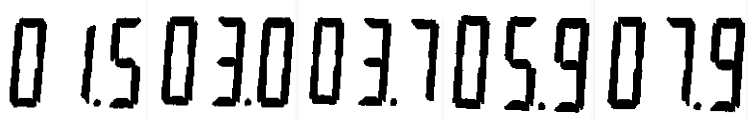

:toc: left
:source-highlighter: highlightjs

= Filtragem de forma com morfologia matemática

O problema consiste em gerar um programa que resolva o problema da pré-filtragem de forma para reconhecimento dos caracteres usando operações morfológicas. 

Programa morfologia.cpp:
[source,C++]
----
#include <iostream>
#include <opencv2/opencv.hpp>

int main(int argc, char** argv) {
  cv::Mat image, erosao, dilatacao, abertura, fechamento, abertfecha,fechaabert;
  cv::Mat str;

  if (argc != 2) {
    std::cout << "morfologia entrada saida\n";
  }

  image = cv::imread(argv[1], cv::IMREAD_UNCHANGED);

//  image = cv::imread(argv[1], -1);
  
  if(image.empty()) {
    std::cout << "Erro ao carregar a imagem: " << argv[1] << std::endl;
    return -1;
  }

  cv::bitwise_not(image,image);

  // elemento estruturante
  str = cv::getStructuringElement(cv::MORPH_RECT, cv::Size(1,11));
  
  // fechamento
  cv::morphologyEx(image, fechamento, cv::MORPH_CLOSE, str);

  cv::Mat matArray[] = {fechamento};
  cv::hconcat(matArray, 1, image);

  cv::bitwise_not(image,image);

  cv::imshow("morfologia", image);

  cv::waitKey();
  return 0;
}

----

A técnica morfologica utilizada para fechar os espaços entre os digitos foi o fechamento da imagem. Onde a image teve os bits invertidos, para inverter a cor da imagem, cria o elemento estruturante, que é uma linha na vertical, realiza o fechamento com esse elemento e por fim reverte os bits da imagem.

:imagesdir:

.Caracteres do visor.

image::digitos.png[digitos]

O resultado dos digitos processados. 

:imagesdir:

.Caracteres ideais para o reconhecimento.

