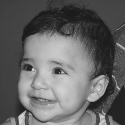
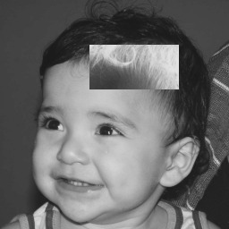
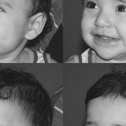

:toc: left
:source-highlighter: highlightjs

= Manipulando Pixels em uma imagem

== *Problema 1:*

O problema consiste em o programa receber uma imagem e dois pontos P1 e P2 localizados dentro da área da imagem e transformar essa região em negativo.

:imagesdir:

.biel.png é a imagem da entrada.

Programa regiões.cpp:
[source,C++]
----
#include <iostream>
#include <opencv2/opencv.hpp>

int main(int, char**){
  cv::Mat image;
  int P1[2], P2[2];

  image= cv::imread("biel.png",cv::IMREAD_GRAYSCALE);
  if(!image.data)
    std::cout << "nao abriu biel.png" << std::endl;

  cv::namedWindow("janela", cv::WINDOW_AUTOSIZE);

  std::cout << "Informe os pontos da região que ficarar negativa:" << std::endl;
  std::cout << "P1: " << std::endl;
  std::cin >> P1[0];
  std::cin >> P1[1];
  std::cout << "P2: " << std::endl;
  std::cin >> P2[0];
  std::cin >> P2[1];

  for(int i=P1[0];i<P1[1];i++){
    for(int j=P2[0];j<P2[1];j++){
      image.at<uchar>(i,j)= 255 - image.at<uchar>(i,j);
    }
  }

  cv::namedWindow("janela", cv::WINDOW_AUTOSIZE);
  cv::imshow("janela", image); 
  cv::imwrite("negativo.png",image); 
  cv::waitKey();

  return 0;
}

----

Para transformar a região em negativo foi necessário apenas pegar os pixels de dentro da região e subtrai-los de 255, invertendo os tons de cinza.

Saida do programa para os pontos P1 (50, 100) e P2 (100, 200):

.Resultado do programa regiões.cpp.

== *Problema 2:*

O problema consiste trocar os quadrantes em diagonal na imagem, utilizando a imagem biel.png.

Programa trocaregioes.cpp:
[source, C++]
----
#include <iostream>
#include <opencv2/opencv.hpp>

int main(int, char**){
  cv::Mat image,Q1,Q2,Q3,Q4;
  int x0,y0,width,height,x,y;

  image= cv::imread("biel.png",cv::IMREAD_GRAYSCALE);
  if(!image.data)
    std::cout << "nao abriu biel.png" << std::endl;

  cv::namedWindow("janela", cv::WINDOW_AUTOSIZE);
  
  x0 = 0;
  y0 = 0;
  width = image.cols;
  height = image.rows;
  x = height/2;
  y = width/2;
  
  Q1 = image(cv::Range(x0,x), cv::Range(y0,y));
  Q2 = image(cv::Range(x0,x),cv::Range(y,width));
  Q3 = image(cv::Range(x,height),cv::Range(y0,y));
  Q4 = image(cv::Range(x,width),cv::Range(y,height));
  cv::Mat image2 = cv::Mat::zeros(image.size(),CV_8UC1);

  Q1.copyTo(image2(cv::Range(x,width),cv::Range(y,height)));
  Q2.copyTo(image2(cv::Range(x,height),cv::Range(y0,y)));
  Q3.copyTo(image2(cv::Range(x0,x),cv::Range(y,width)));
  Q4.copyTo(image2(cv::Range(x0,x), cv::Range(y0,y)));
  
  cv::imshow("janela", image2);
  cv::imwrite("troca.png",image2); 
  cv::waitKey(0);

  return 0;
}

----

Para realiza a troca dos quadrando, a imagem de entrada foi recortada em quatro pedaços, os quadrantes, e recolada em outra imagem vazia, trocando o quadrante um pelo três e o dois pelo quatro.

Para isso foi necessário saber quais as regiões dos quadrantes da imagem, assim foram pegos dois pontos das imagens para serem recortadas, por exemplo, para o quadrante 1 foram os pontos onde x e y são zeros, e quando x e y são a metade da altura e largura da imagem, e para o quadrante 4 foram os pontos onde x e y são a metade da altura e largura da imagem e quando x e y são a altura e largura da imagem, respectivamente.

Saida do programa:

.Troca dos quadrantes da figura 1.

