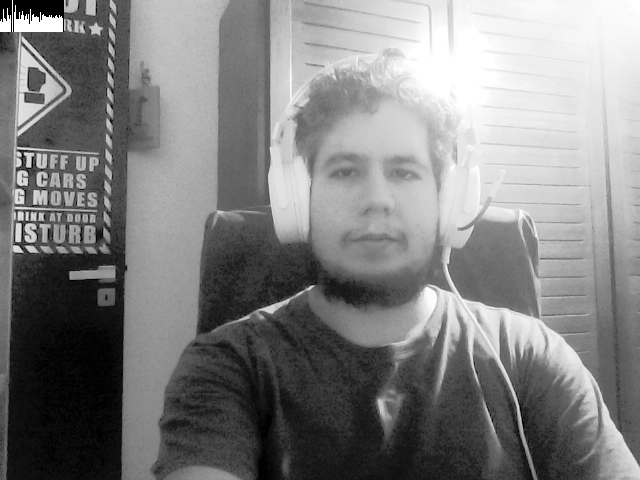

:toc: left
:source-highlighter: highlightjs

= Manipulação de histogramas

== *Problema 1:*

O Problema consiste em realizar a equalização do histograma de uma imagem capturada por uma câmera.

Programa equalized.cpp:
[source,C++]
----
#include <iostream>
#include <opencv2/opencv.hpp>
#include <opencv2/highgui.hpp>
#include <opencv2/imgproc.hpp>

int main(int argc, char** argv){
  cv::Mat image, hst;
  int width, height;
  cv::VideoCapture cap;
  std::vector<cv::Mat> planes;
  cv::Mat hist,histE;
  int nbins = 64;
  float range[] = {0, 255};
  const float *histrange = { range };
  bool uniform = true;
  bool acummulate = false;
  int key;

	cap.open(0);
  
  if(!cap.isOpened()){
    std::cout << "cameras indisponiveis";
    return -1;
  }
  
  cap.set(cv::CAP_PROP_FRAME_WIDTH, 640);
  cap.set(cv::CAP_PROP_FRAME_HEIGHT, 480);  
  width = cap.get(cv::CAP_PROP_FRAME_WIDTH);
  height = cap.get(cv::CAP_PROP_FRAME_HEIGHT);

  std::cout << "largura = " << width << std::endl;
  std::cout << "altura  = " << height << std::endl;

  int histw = nbins, histh = nbins/2;
  cv::Mat histImg(histh, histw, CV_8UC1, cv::Scalar(0,0,0));
  cv::Mat histImgE(histh, histw, CV_8UC1, cv::Scalar(0,0,0));

  while(1){
    cap >> image;
    cv::cvtColor( image, image, cv::COLOR_BGR2GRAY);
    cv::equalizeHist(image, hst);

    cv::calcHist(&image, 1, 0, cv::Mat(), hist, 1,
                 &nbins, &histrange,
                 uniform, acummulate);
    cv::calcHist(&hst, 1, 0, cv::Mat(), histE, 1,
                 &nbins, &histrange,
                 uniform, acummulate);
    
    cv::normalize(hist, hist, 0, histImg.rows, cv::NORM_MINMAX, -1, cv::Mat());
    cv::normalize(histE, histE, 0, histImg.rows, cv::NORM_MINMAX, -1, cv::Mat());
    
    histImg.setTo(cv::Scalar(0));
    histImgE.setTo(cv::Scalar(0));
    
    for(int i=0; i<nbins; i++){
      cv::line(histImg,
               cv::Point(i, histh),
               cv::Point(i, histh-cvRound(hist.at<float>(i))),
               cv::Scalar(255, 255, 255), 1, 8, 0);
      cv::line(histImgE,
               cv::Point(i, histh),
               cv::Point(i, histh-cvRound(histE.at<float>(i))),
               cv::Scalar(255, 255, 255), 1, 8, 0);
    }
    histImg.copyTo(image(cv::Rect(0,0,nbins, histh)));
    histImgE.copyTo(hst(cv::Rect(0,0,nbins, histh)));

    cv::imshow("source image", image);
    cv::imshow("equalized image", hst);

    key = cv::waitKey(30);
    if (key == 'f'){
      cv::imwrite("gray.png", image);
      cv::imwrite("equalized.png", hst);
    }
    if(key == 27) break;
  }
  return 0;
}

----

Para equalizar a equalização do histograma foi usado uma função de equalização e foi extraído os histogramas das imagens em tons de cinza, equalizada e não equalizada.

:imagesdir:

.imagem original em tons de cinza.

:imagesdir:

.imagem em tons de cinza com o histograma equalizado, com variação de luzes (apagada).

:imagesdir:

.imagem em tons de cinza com o histograma equalizado, com variação de luzes (acessa).

== *Problema 2:*

O problema consiste em implementar um detector de movimento.

Programa motiondetector.cpp:
[source,C++]
----
#include <iostream>
#include <opencv2/opencv.hpp>
#include <opencv2/imgcodecs.hpp>
#include <opencv2/highgui.hpp>
#include <opencv2/imgproc.hpp>

int main(int argc, char** argv){
  cv::Mat image, image2;
  int width, height;
  cv::VideoCapture cap;
  cv::Mat hist,hist2;
  int nbins = 64;
  float range[] = {0, 255};
  const float *histrange = { range };
  bool uniform = true;
  bool acummulate = false;
  int key;

	cap.open(0);
  
  if(!cap.isOpened()){
    std::cout << "cameras indisponiveis";
    return -1;
  }
  
  cap.set(cv::CAP_PROP_FRAME_WIDTH, 640);
  cap.set(cv::CAP_PROP_FRAME_HEIGHT, 480);  
  width = cap.get(cv::CAP_PROP_FRAME_WIDTH);
  height = cap.get(cv::CAP_PROP_FRAME_HEIGHT);

  std::cout << "largura = " << width << std::endl;
  std::cout << "altura  = " << height << std::endl;

  int histw = nbins, histh = nbins/2;
  cv::Mat histImg(histh, histw, CV_8UC1, cv::Scalar(0,0,0));
  cv::Mat histImg2(histh, histw, CV_8UC1, cv::Scalar(0,0,0));

  while(1){
    cap >> image >> image2;
    cv::cvtColor( image, image, cv::COLOR_BGR2GRAY);
    cv::cvtColor( image2, image2, cv::COLOR_BGR2GRAY);

    cv::calcHist(&image, 1, 0, cv::Mat(), hist, 1,
                 &nbins, &histrange,
                 uniform, acummulate);
    
    cv::calcHist(&image2, 1, 0, cv::Mat(), hist2, 1,
                 &nbins, &histrange,
                 uniform, acummulate);

    cv::normalize(hist, hist, 0, histImg.rows, cv::NORM_MINMAX, -1, cv::Mat());
    cv::normalize(hist2, hist2, 0, histImg.rows, cv::NORM_MINMAX, -1, cv::Mat());
    
    histImg.setTo(cv::Scalar(0));
    histImg2.setTo(cv::Scalar(0));

    for(int i=0; i<nbins; i++){
      cv::line(histImg2,
               cv::Point(i, histh),
               cv::Point(i, histh-cvRound(hist.at<float>(i))),
               cv::Scalar(255, 255, 255), 1, 8, 0);
    }
    histImg2.copyTo(image2(cv::Rect(0,0,nbins, histh)));

    double hst_md = cv::compareHist(hist,hist2,1);

    if(hst_md > 3){
        std::cout << "Movimento Detectado" << std::endl;
        cv::putText(image2,"Alerta",cv::Point(0,70),cv::FONT_HERSHEY_DUPLEX,1,cv::Scalar(0,255,0),2,false);
    }

    cv::imshow("motion detection", image2);

    key = cv::waitKey(30);
    if (key == 'f'){
      cv::imwrite("motion.png", image2);
    }
    if(key == 27) break;
  }
  return 0;
}

----

Para detectar o movimento de algo pela câmera, foram retirados dois frames e calculados os histogramas deles, por fim foi feito a diferença dos histogramas das imagens, se tiver uma mudança significativa, irá aparecer um sinal de alerta na tela, indicando a detecção do movimento.

:imagesdir:

.Saida do programa de detecção de imagem.

:imagesdir:

.Sinal de detecção de movimento.

