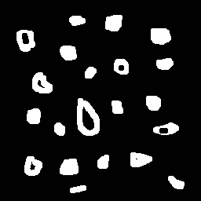

:toc: left
:source-highlighter: highlightjs

= Preenchimento de regiões

== *Problema 1:*

No código do labeling.cpp, para solucionar a limitação de verificar apenas 255 objetos na tela, caso existam mais, é necessário substituir uchar por ushort, pois uchar só comporta valores de 0 a 255, enquanto o ushort comporta valores de 0 a 65535, um número que, muito possivelmente, não é possível alcançar esse número de cores ou precisar de.

== *Problema 2:*

O problema consiste aprimorar o algoritmo para identificar regiões com ou sem buracos que existam na imagem, não contando as bolhas que tocam nas bordas. 

:imagesdir:

.bolhas.png é a imagem de entrada.

image::bolhas.png[bolhas]

Programa labeling.cpp:
[source,C++]
----
#include <iostream>
#include <opencv2/opencv.hpp>

using namespace cv;

int main(int argc, char** argv) {
  cv::Mat image, realce;
  int width, height;
  int nohole, hole;

  cv::Point p;
  image = cv::imread(argv[1], cv::IMREAD_GRAYSCALE);

  if (!image.data) {
    std::cout << "imagem nao carregou corretamente\n";
    return (-1);
  }

  width = image.cols;
  height = image.rows;

  p.x = 0;
  p.y = 0;

  // retira os objetos das bordas
  for (int i = 0; i < height; i++) {
    for (int j = 0; j < width; j++) {
      if(i == 0 || j == 0 || i == height-1 || j == width-1){
          p.x = j;
          p.y = i;

          cv::floodFill(image, p, 0);
          cv::floodFill(image, p, 1);
      }
    }
  }

  // busca objetos presentes
  hole = 0;
  nohole = 0;
  for (int i = 0; i < height; i++) {
    for (int j = 0; j < width; j++) {
      if (image.at<uchar>(i, j) == 0) {
        // achou um objeto
        hole++;
        // para o floodfill as coordenadas
        // x e y são trocadas.
        p.x = j;
        p.y = i;
        // preenche o objeto com o contador
        cv::floodFill(image, p, 1);
      }

      if(image.at<uchar>(i, j) == 255){
        // achou um objeto
        nohole++;
        // para o floodfill as coordenadas
        // x e y são trocadas.
        p.x = j;
        p.y = i;
        // preenche o objeto com o contador
        cv::floodFill(image, p, 254);
      }
    }
  }
  std::cout << "a figura tem " << nohole << " bolhas\n";
  std::cout << "a figura tem " << hole << " bolhas com buracos\n";
  std::cout << "a figura tem " << nohole-hole << " bolhas sem buracos\n";

  cv::imshow("image", image);
  cv::imwrite("labeling.png", image);
  cv::waitKey();
  return 0;
}

----

Para contar os objetos com ou sem buracos, primeiramente retiramos os objetos que tocam na borda, pintando eles da cor do fundo da imagem e depois o fundo é pintado com outra cor, depois verificamos quantos buracos temos na imagem procurando a cor preto, contamos e pintamos o buraco de outra cor, para não ser contado de novo e depois verificamos quantos objetos temos na imagem procurando a cor branca, contamos e pintamos o objeto de outra cor, para não ser contado de novo, para saber quantos objetos temos sem buracos subtraímos a quantidade de objetos pela quantidade de buracos.

Saida do programa:

:imagesdir:

.bolhas com e sem buracos contadas com outros tons de cinza.

:imagesdir:

.Contem do número de bolhas com e sem buracos.

image::Captura de tela_2023-09-28_16-58-47.png[Captura de tela_2023-09-28_16-58-47]