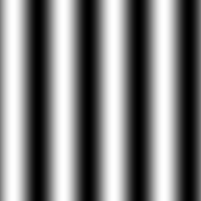

:toc: left
:source-highlighter: highlightjs

= Serialização de dados em ponto flutuante via FileStorage

Problema consistem em gerar um senoide de 4 períodos com amplitude de 127, gravar no formato PNG e YML, e comparar os arquivos gerados.
Programa filestorage:
[source,C++]
----
#include <iostream>
#include <opencv2/opencv.hpp>
#include <sstream>
#include <string>

int SIDE = 256;
int PERIODOS = 4;

int main(int argc, char** argv) {
  std::stringstream ss_img, ss_yml;
  cv::Mat image;

  ss_yml << "senoide-" << SIDE << ".yml";
  image = cv::Mat::zeros(SIDE, SIDE, CV_32FC1);

  cv::FileStorage fs(ss_yml.str(), cv::FileStorage::WRITE);

  for (int i = 0; i < SIDE; i++) {
    for (int j = 0; j < SIDE; j++) {
      image.at<float>(i, j) = 127*sin(2 * M_PI * PERIODOS * j / SIDE) + 128;
    }
  }

  fs << "mat" << image;
  fs.release();

  cv::normalize(image, image, 0, 255, cv::NORM_MINMAX);
  image.convertTo(image, CV_8U);
  ss_img << "senoide-" << SIDE << ".png";
  cv::imwrite(ss_img.str(), image);

  fs.open(ss_yml.str(), cv::FileStorage::READ);
  fs["mat"] >> image;

  cv::normalize(image, image, 0, 255, cv::NORM_MINMAX);
  image.convertTo(image, CV_8U);

  cv::imshow("image", image);
  cv::waitKey();

  return 0;
}

----

Saida em PNG:

. Imagem gerada pelo programa filestorage.

Saida em XML (Primeira linha do primeiro período):
[source,C++]
----
%YAML:1.0
---
mat: !!opencv-matrix
   rows: 256
   cols: 256
   dt: f
   data: [64., 7.01750793e+01, 7.62906876e+01, 8.22879333e+01,
       8.81090546e+01, 9.36979980e+01, 9.90009232e+01, 1.03966774e+02,
       1.08547729e+02, 1.12699661e+02, 1.16382584e+02, 1.19561043e+02,
       1.22204407e+02, 1.24287239e+02, 1.25789474e+02, 1.26696640e+02,
       127., 1.26696640e+02, 1.25789474e+02, 1.24287239e+02,
       1.22204407e+02, 1.19561043e+02, 1.16382584e+02, 1.12699661e+02,
       1.08547729e+02, 1.03966774e+02, 9.90009232e+01, 9.36979980e+01,
       8.81090546e+01, 8.22879333e+01, 7.62906876e+01, 7.01750793e+01, 64., 5.78249207e+01, 5.17093086e+01, 4.57120667e+01,
       3.98909454e+01, 3.43020058e+01, 2.89990749e+01, 2.40332222e+01,
       1.94522724e+01, 1.53003416e+01, 1.16174145e+01, 8.43896008e+00,
       5.79558945e+00, 3.71275878e+00, 2.21052742e+00, 1.30336225e+00,
       1.

----

Comparando a imagem formada em PNG com a primeira linha do arquivo XML, é visível que os valores salvos são correspondentes aos valores de tons de cinza dos pixels na imagem, começa com o tom de 64, aumenta até a amplitude de 127, desce até o tom 1 e começa tudo de novo, seguindo uma senoide. 