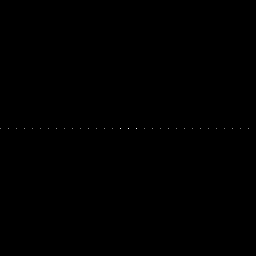
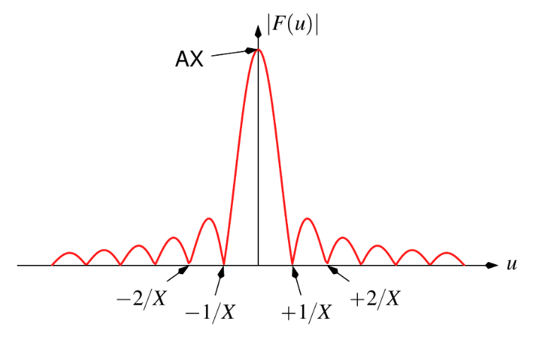
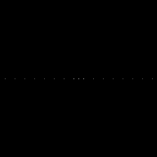

:toc: left
:source-highlighter: highlightjs

= Transformada Discreta de Fourier

O problema consiste em utilizar o codigo dftimage.cpp para obter o espectro de magnitude da imagem gerada pelo filestorage.cpp, comparar esse espectro com o valor teórico da transformada de Fourier da senóide, modificar o dftimage.cpp para ler a imagem em ponto flutuante armazenada no arquivo YAML gerada pelo filestorage.cpp e comparar esse novo espectro gerado com o valor teórico da transformada de Fourier da senóide.

Programa dftimage.cpp:
[source,C++]
----
#include <iostream>
#include <vector>
#include <opencv2/opencv.hpp>

void swapQuadrants(cv::Mat& image) {
  cv::Mat tmp, A, B, C, D;

  // se a imagem tiver tamanho impar, recorta a regiao para o maior
  // tamanho par possivel (-2 = 1111...1110)
  image = image(cv::Rect(0, 0, image.cols & -2, image.rows & -2));

  int centerX = image.cols / 2;
  int centerY = image.rows / 2;

  // rearranja os quadrantes da transformada de Fourier de forma que 
  // a origem fique no centro da imagem
  // A B   ->  D C
  // C D       B A
  A = image(cv::Rect(0, 0, centerX, centerY));
  B = image(cv::Rect(centerX, 0, centerX, centerY));
  C = image(cv::Rect(0, centerY, centerX, centerY));
  D = image(cv::Rect(centerX, centerY, centerX, centerY));

  // swap quadrants (Top-Left with Bottom-Right)
  A.copyTo(tmp);
  D.copyTo(A);
  tmp.copyTo(D);

  // swap quadrant (Top-Right with Bottom-Left)
  C.copyTo(tmp);
  B.copyTo(C);
  tmp.copyTo(B);
}

int main(int argc, char** argv) {
  cv::Mat image, padded, complexImage;
  std::vector<cv::Mat> planos; 

  // para a leitura do arquivo YAML
  cv::FileStorage fs("senoide-256.yml", cv::FileStorage::READ);
  fs["mat"] >> image;
  image.convertTo(image, CV_8U);
  
  //image = imread(argv[1], cv::IMREAD_GRAYSCALE);
  if (image.empty()) {
    std::cout << "Erro abrindo imagem" << argv[1] << std::endl;
    return EXIT_FAILURE;
  }

  // expande a imagem de entrada para o melhor tamanho no qual a DFT pode ser
  // executada, preenchendo com zeros a lateral inferior direita.
  int dft_M = cv::getOptimalDFTSize(image.rows);
  int dft_N = cv::getOptimalDFTSize(image.cols); 
  cv::copyMakeBorder(image, padded, 0, dft_M - image.rows, 0, dft_N - image.cols, cv::BORDER_CONSTANT, cv::Scalar::all(0));

  // prepara a matriz complexa para ser preenchida
  // primeiro a parte real, contendo a imagem de entrada
  planos.push_back(cv::Mat_<float>(padded)); 
  // depois a parte imaginaria com valores nulos
  planos.push_back(cv::Mat::zeros(padded.size(), CV_32F));

  // combina os planos em uma unica estrutura de dados complexa
  cv::merge(planos, complexImage);  

  // calcula a DFT
  cv::dft(complexImage, complexImage); 
  swapQuadrants(complexImage);

  // planos[0] : Re(DFT(image))
  // planos[1] : Im(DFT(image))
  cv::split(complexImage, planos);

  // calcula o espectro de magnitude e de fase (em radianos)
  cv::Mat magn, fase;
  cv::cartToPolar(planos[0], planos[1], magn, fase, false);
  cv::normalize(fase, fase, 0, 1, cv::NORM_MINMAX);

  // caso deseje apenas o espectro de magnitude da DFT, use:
  cv::magnitude(planos[0], planos[1], magn); 

  // some uma constante para evitar log(0)
  // log(1 + sqrt(Re(DFT(image))^2 + Im(DFT(image))^2))
  magn += cv::Scalar::all(1);

  // calcula o logaritmo da magnitude para exibir
  // com compressao de faixa dinamica
  log(magn, magn);
  cv::normalize(magn, magn, 0, 1, cv::NORM_MINMAX);

  // exibe as imagens processadas
  cv::imshow("Imagem", image);  
  cv::imshow("Espectro de magnitude", magn);
  cv::imshow("Espectro de fase", fase);

  cv::waitKey();
  return EXIT_SUCCESS;
}

----

A seguinte imagem é uma imagem gerada pelo filestorage.cpp.

:imagesdir:

Imagem original

image::senoide-256.png[senoide-256]

O espectro de magnitude foi gerado pela figura anterior.

:imagesdir:

.Espectro de magnitude.

:imagesdir:

.Função Sinc.

Comparando o espectro de magnitude com o valor teórico da transformada de Fourier da senóide, vemos que o padrão do espectro é normalizado, pois essa imagem foi normalizada.

Saida em YAML (Primeira linha do primeiro período):
[source,C++]
----
%YAML:1.0
---
mat: !!opencv-matrix
   rows: 256
   cols: 256
   dt: f
   data: [ 128., 1.52776474e+02, 1.76600800e+02, 1.98557419e+02,
       2.17802567e+02, 2.33596634e+02, 2.45332703e+02, 2.52559738e+02,
       255., 2.52559738e+02, 2.45332703e+02, 2.33596634e+02,
       2.17802567e+02, 1.98557419e+02, 1.76600800e+02, 1.52776474e+02,

----

:imagesdir:

.Espectro de magnitude do arquivo YAML.

Comparando com o espectro de magnitude do arquivo YAML, vemos que ele obedece o padrão da função, inclusive com os três pontos centrais, isso pois não foi normalizado como a imagem original.